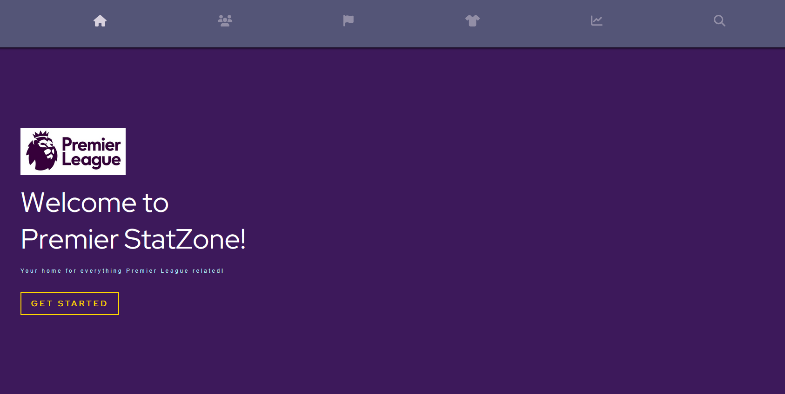
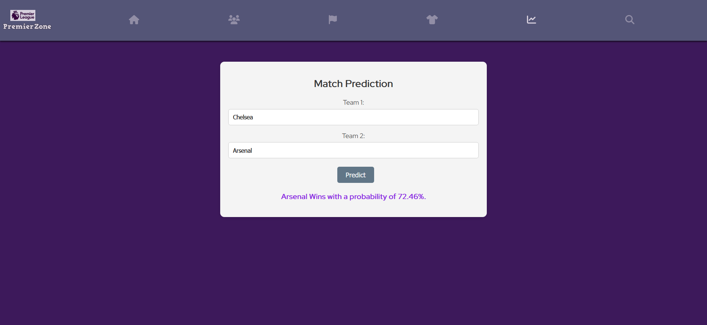

# Premier League Stats & Prediction Platform

A comprehensive, cloud-native web application for exploring Premier League statistics and predicting match outcomes using machine learning. Built with modern microservices architecture, event-driven processing, and automated CI/CD deployment.



## 🚀 Features

### 📊 Player Statistics

- **Comprehensive Player Database**: Browse detailed statistics for all Premier League players
- **Advanced Filtering**: Filter players by team, position, nationality, and performance metrics
- **Interactive Data Visualization**: Clean, responsive interface for exploring player data

### 🤖 Match Prediction

- **ML-Powered Predictions**: Advanced machine learning model using XGBoost and statistical analysis
- **Real-time Predictions**: Get instant match outcome predictions for any two Premier League teams
- **Historical Performance**: Predictions based on comprehensive historical data and team statistics



### 🔍 Smart Search & Filtering

- **Multi-criteria Search**: Search players by name, team, position, or nationality
- **Performance-based Filtering**: Filter by goals, assists, playing time, and other key metrics
- **Responsive Design**: Optimized for desktop and mobile viewing

### Quick AWS Free Deployment:

1. **Launch Free Tier EC2**:

```bash
# t2.micro instance (free tier eligible)
aws ec2 run-instances --image-id ami-0abcdef1234567890 --instance-type t2.micro --key-name your-key
```

2. **Create Free RDS**:

```bash
# db.t2.micro PostgreSQL (free tier eligible)
aws rds create-db-instance --db-instance-identifier premiere-db --db-instance-class db.t2.micro --engine postgres
```

3. **Deploy Application**:

```bash
# SSH to EC2 and run docker-compose
ssh -i your-key.pem ec2-user@your-ec2-ip
git clone your-repo && cd premiere
docker-compose -f docker-compose.prod.yml up -d
```

## 📱 Application Overview

### 📊 Player Statistics Dashboard

- **468 Players** loaded from all Premier League teams
- **Real-time filtering** by position, team, nationality
- **Performance metrics** including goals, assists, playing time
- **Responsive design** for mobile and desktop

### 🔄 Kafka Event Streaming

- **Real-time data processing** via Apache Kafka
- **Event-driven architecture** for scalable microservices
- **Monitoring dashboard** at `localhost:8090` (Kafdrop UI)
- **Message throughput**: Handles thousands of events per second

## 🏗️ Architecture Overview

This application follows a modern **microservices architecture** with **event-driven processing**:

```
┌─────────────────┐    ┌──────────────────┐    ┌─────────────────┐
│   Web Scraper   │───▶│     Kafka        │───▶│ Data Processor  │
│   (Python)      │    │   Message Bus    │    │  Microservice   │
└─────────────────┘    └──────────────────┘    └─────────────────┘
                                │                        │
                                │                        ▼
┌─────────────────┐    ┌──────────────────┐    ┌─────────────────┐
│   Frontend      │───▶│   Backend API    │───▶│   PostgreSQL    │
│   (React)       │    │ (Spring Boot)    │    │    Database     │
└─────────────────┘    └──────────────────┘    └─────────────────┘
```

### Key Architectural Benefits:

- **Scalability**: Independent scaling of each microservice
- **Resilience**: Fault isolation and graceful degradation
- **Maintainability**: Clear separation of concerns
- **Event-Driven**: Asynchronous processing for better performance

## 🛠️ Technology Stack

### Frontend

- **React.js** - Modern UI framework
- **SASS/SCSS** - Advanced styling and responsive design
- **React Router** - Client-side routing
- **Axios** - HTTP client for API communication
- **Font Awesome** - Professional icons and UI elements
- **Nginx** - Production web server with reverse proxy

### Backend Microservices

- **Java Spring Boot** - RESTful API framework
- **Spring Data JPA** - Database abstraction layer
- **Spring Kafka** - Event streaming integration
- **Spring Boot Actuator** - Production monitoring and health checks
- **PostgreSQL** - Robust relational database
- **Flyway** - Database migration management

### Event Streaming & Messaging

- **Apache Kafka** - Distributed event streaming platform
- **Zookeeper** - Kafka cluster coordination
- **Kafka UI** - Web-based Kafka monitoring

### Machine Learning

- **Python** - Data processing and ML implementation
- **XGBoost** - Gradient boosting for match predictions
- **Scikit-learn** - Machine learning utilities
- **Pandas** - Data manipulation and analysis

### Data Collection

- **Web Scraping** - Automated data collection with Kafka integration
- **Beautiful Soup** - HTML parsing and data extraction
- **Kafka Python Client** - Event publishing

### DevOps & Infrastructure

- **Docker** - Containerization
- **Docker Compose** - Multi-container orchestration
- **GitHub Actions** - CI/CD automation
- **AWS EC2** - Cloud hosting
- **AWS RDS** - Managed database service
- **AWS ECR** - Container registry
- **AWS S3** - Static asset hosting (optional)

## 🧪 Testing Suite

### Frontend Testing (Jest)

- **12 Test Suites** with **44 comprehensive tests**
- **Component Testing**: All React components fully tested
- **User Interaction Testing**: Button clicks, form submissions, navigation
- **API Integration Testing**: Mocked HTTP requests and responses
- **Error Handling**: Loading states, error messages, edge cases
- **Search & Filtering**: Multi-criteria search functionality

**Test Coverage:**

- ✅ AnimatedLetters Component
- ✅ Home Component
- ✅ DataHandling Component
- ✅ App Component
- ✅ Sidebar Component
- ✅ Layout Component
- ✅ MatchPrediction Component
- ✅ Teams Component
- ✅ Position Component
- ✅ Nation Component
- ✅ Search Component
- ✅ TeamData Component

```bash
# Run frontend tests
cd Frontend
npm test
```

### Backend Testing (JUnit & Spring Boot Test)

- **Unit Tests**: Service layer and business logic testing
- **Integration Tests**: Full API endpoint testing with test database
- **Controller Tests**: REST API endpoint validation
- **Repository Tests**: Database operations and queries
- **Prediction Service Tests**: Machine learning model integration

**Test Coverage:**

- ✅ PlayerController (REST API endpoints)
- ✅ PlayerService (Business logic)
- ✅ PlayerRepository (Database operations)
- ✅ MatchPredictionController (ML prediction API)
- ✅ PredictionService (ML model integration)
- ✅ Integration Tests (Full application flow)

```bash
# Run backend tests
cd Backend
mvn test
```

## 📁 Complete Project Structure

```
premiere/
├── Backend/                              # 🚀 Main Spring Boot API
│   ├── src/main/java/com/example/pl_connect/
│   │   ├── PlConnectApplication.java     # Application entry point
│   │   ├── controller/                   # 🎯 REST API Controllers
│   │   │   └── PlayerController.java     # Player API endpoints
│   │   ├── service/                      # 🔧 Business Logic Services
│   │   │   └── PlayerService.java        # Player business logic
│   │   ├── player/                       # 👤 Player Domain
│   │   │   ├── Player.java              # Player entity
│   │   │   ├── PlayerRepository.java    # Data access layer
│   │   │   └── PlayerConfig.java        # Player configuration
│   │   ├── prediction/                   # 🤖 ML Prediction
│   │   │   ├── MatchPredictionController.java  # ML prediction API
│   │   │   ├── MatchPredictionRequest.java     # Request models
│   │   │   └── PredictionService.java          # Prediction logic
│   │   └── config/
│   │       ├── DataInitializer.java      # Database initialization
│   │       └── CorsConfig.java          # CORS configuration
│   ├── src/test/java/                    # 🧪 Backend Tests
│   │   └── com/example/pl_connect/
│   │       ├── player/
│   │       │   ├── PlayerControllerTest.java    # Controller tests
│   │       │   ├── PlayerServiceTest.java       # Service tests
│   │       │   └── PlayerRepositoryTest.java    # Repository tests
│   │       ├── prediction/
│   │       │   ├── MatchPredictionControllerTest.java
│   │       │   └── PredictionServiceTest.java
│   │       ├── integration/
│   │       │   └── PlayerIntegrationTest.java   # Integration tests
│   │       └── PlConnectApplicationTests.java   # Application tests
│   ├── src/main/resources/
│   │   ├── application.properties       # Application configuration
│   │   ├── application-test.properties  # Test configuration
│   │   ├── data/prem_stats.csv         # Player statistics data
│   │   ├── db/migration/               # Flyway database migrations
│   │   └── python/pred.py              # Python ML model
│   ├── Dockerfile                      # Container configuration
│   └── pom.xml                        # Maven dependencies
│
├── Backend/data-processor-service/      # 🔄 Kafka Data Processor
│   ├── src/main/java/com/example/dataprocessor/
│   │   ├── DataProcessorApplication.java    # Microservice entry point
│   │   ├── consumer/
│   │   │   └── PlayerDataConsumer.java     # Kafka message consumer
│   │   ├── entity/Player.java              # Player entity
│   │   ├── model/PlayerData.java           # Data transfer object
│   │   ├── service/PlayerDataService.java  # Business logic
│   │   └── repository/PlayerRepository.java # Data persistence
│   ├── src/main/resources/
│   │   └── application.yml             # YAML configuration
│   ├── Dockerfile                      # Container configuration
│   └── pom.xml                        # Maven dependencies
│
├── Frontend/                           # ⚛️ React Application
│   ├── src/
│   │   ├── App.js                     # Main application component
│   │   ├── components/
│   │   │   ├── Home/index.js          # Home dashboard
│   │   │   ├── Teams/index.js         # Teams overview
│   │   │   ├── Search/index.js        # Player search
│   │   │   ├── Position/index.js      # Position filtering
│   │   │   ├── Nation/index.js        # Nationality filtering
│   │   │   ├── MatchPrediction/index.js # ML predictions
│   │   │   ├── DataHandling/index.js  # Data management
│   │   │   ├── Sidebar/index.js       # Navigation
│   │   │   ├── Layout/index.js        # Page layout
│   │   │   └── AnimatedLetters/index.js # UI animations
│   │   ├── data/
│   │   │   ├── teams.json             # Team data
│   │   │   ├── positions.json         # Position data
│   │   │   └── nations.json           # Country data
│   │   └── assets/images/             # Application images
│   ├── src/                           # 🧪 Frontend Tests
│   │   ├── components/
│   │   │   ├── AnimatedLetters/AnimatedLetters.test.js
│   │   │   ├── Home/Home.test.js
│   │   │   ├── DataHandling/DataHandling.test.js
│   │   │   ├── Sidebar/Sidebar.test.js
│   │   │   ├── Layout/Layout.test.js
│   │   │   ├── MatchPrediction/MatchPrediction.test.js
│   │   │   ├── Teams/Teams.test.js
│   │   │   ├── Position/Position.test.js
│   │   │   ├── Nation/Nation.test.js
│   │   │   ├── Search/Search.test.js
│   │   │   └── TeamData/TeamData.test.js
│   │   └── App.test.js               # Main app tests
│   ├── public/
│   │   ├── welcome.PNG                # Home page screenshot
│   │   ├── match-prediction.PNG       # Prediction page screenshot
│   │   ├── teams/                     # Team logos (20 PNG files)
│   │   └── positions/                 # Position images
│   ├── package.json                   # Node.js dependencies
│   ├── Dockerfile                     # Container configuration
│   └── nginx.conf                     # Production web server
│
├── DataScraping/                      # 🕷️ Web Scraping with Kafka
│   ├── PL_Data_Scraping_Kafka.py     # Kafka-enabled scraper
│   ├── Dockerfile                     # Container configuration
│   └── requirements.txt               # Python dependencies
│
├── MatchPredicting/                   # 🤖 ML Prediction Models
│   ├── pred.py                        # XGBoost prediction model (main)
│   └── matches.csv                    # Training data
│
├── .github/workflows/                 # 🔄 CI/CD Pipeline
│   └── ci-cd-pipeline.yml            # GitHub Actions workflow
│
├── 📄 Configuration Files
├── docker-compose.yml                 # Development environment
├── docker-compose.prod.yml            # Production environment
├── deploy-local.sh                    # Local deployment script
├── DEPLOYMENT_GUIDE.md               # Deployment instructions
└── README.md                         # Project documentation

📊 Total Files: 100+ files across 8 major components
🎯 Languages: Java, JavaScript, Python, SQL, YAML, Dockerfile
🏗️ Architecture: Microservices + Event-Driven + ML + React SPA
```

## 🔄 Kafka Event Streaming - TODO & Future Enhancements

### Current Implementation:

- ✅ Kafka cluster with Zookeeper
- ✅ Data processor microservice consuming player data
- ✅ Web scraper publishing to Kafka topics
- ✅ Kafka UI for monitoring and management

### 🚧 Planned Kafka Enhancements:

#### 1. **Real-time Match Events**

- **Live Match Data Streaming**: Real-time goals, cards, substitutions
- **Event Topic**: `match-events` with live game updates
- **Consumer**: Match event processor for live statistics
- **Frontend**: Live match dashboard with real-time updates

#### 2. **Player Performance Analytics**

- **Performance Metrics Topic**: `player-performance`
- **Real-time Statistics**: Goals, assists, passes, tackles per match
- **ML Pipeline**: Stream processing for performance predictions
- **Alerts**: Performance threshold notifications

#### 3. **Enhanced Data Processing**

- **Stream Processing**: Kafka Streams for complex event processing
- **Data Validation**: Schema registry for message validation
- **Error Handling**: Dead letter queues for failed messages
- **Partitioning**: Optimized topic partitioning by team/league

### Implementation Priority:

1. 🔥 **High**: Real-time match events streaming
2. 🔥 **High**: Enhanced error handling and monitoring
3. 📊 **Medium**: Player performance analytics pipeline
4. 📊 **Medium**: Stream processing with Kafka Streams
5. 🚀 **Low**: Multi-league support and scaling

## 🚀 Getting Started

### 🎯 One-Click Deployment with deploy-local.sh

The easiest way to run the entire platform is using our automated deployment script:

```bash
git clone <repository-url>
cd premiere
chmod +x deploy-local.sh
./deploy-local.sh
```

**What the script does:**

- ✅ Checks Docker and Docker Compose availability
- 🧹 Cleans up previous containers
- 🏗️ Builds and starts all microservices
- ⏳ Waits for all services to be healthy
- 📨 Creates necessary Kafka topics
- 📊 Shows service status and URLs

**Script options:**

```bash
./deploy-local.sh --with-scraper    # Also runs web scraper
./deploy-local.sh --help            # Show help
```

**After deployment, access:**

- 🌐 **Frontend**: http://localhost:3000
- 🔧 **Backend API**: http://localhost:8080
- ⚙️ **Data Processor**: http://localhost:8081
- 📊 **Kafka UI**: http://localhost:8090

### Manual Docker Compose Setup

If you prefer manual control:

```bash
git clone <repository-url>
cd premiere
docker-compose up -d --build
```

**Optional web scraper:**

```bash
docker-compose --profile scraper up scraper
```

### Manual Setup

#### Prerequisites

- **Java 17+** - For Spring Boot backend
- **Node.js 18+** - For React frontend
- **PostgreSQL 12+** - Database server
- **Python 3.8+** - For ML components and data scraping
- **Maven 3.6+** - Java dependency management
- **Docker & Docker Compose** - For containerized deployment

#### Database Setup

**Option 1: Automatic (Recommended)**
The application uses Flyway for automatic database migrations. Tables will be created automatically on first run.

**Option 2: Manual Setup**
If you need to set up the database manually, refer to the database initialization commands. The application will handle table creation through Flyway migrations.

**Note**: For production deployment, use environment variables to configure database connections securely.

#### Backend Services Setup

**Main Backend API:**

```bash
cd Backend
mvn clean install
mvn spring-boot:run
```

**Data Processor Service:**

```bash
cd Backend/data-processor-service
mvn clean install
mvn spring-boot:run
```

#### Frontend Setup

```bash
cd Frontend
npm install
npm start
```

#### Kafka Setup

For local development, use the provided Docker Compose configuration or install Kafka manually.

## 🔄 How the Application Works

### **Data Flow Architecture:**

1. **📊 Data Collection**: Web scraper collects Premier League statistics from various sources
2. **📨 Event Streaming**: Kafka receives scraped data as JSON messages in the `player-data` topic
3. **⚙️ Data Processing**: Data Processor microservice consumes Kafka messages and processes data
4. **🗄️ Data Storage**: PostgreSQL stores processed player and match statistics
5. **🔧 API Layer**: Backend API serves data to frontend via REST endpoints
6. **🌐 User Interface**: React frontend displays interactive statistics and predictions

### **Key API Endpoints:**

#### Player Statistics

- `GET /api/v1/player` - Get all players with filtering options
- `GET /api/v1/player?team={team}` - Filter players by team
- `GET /api/v1/player?position={position}` - Filter by position
- `GET /api/v1/player?nation={nation}` - Filter by nationality

#### Match Predictions

- `POST /api/v1/predict` - Get match outcome prediction

#### Health Monitoring

- `GET /actuator/health` - Service health status
- `GET /actuator/metrics` - Application metrics

## ☁️ AWS Cloud Deployment

The platform is designed for production deployment on AWS with a cloud-native architecture:

### 🏗️ AWS Infrastructure

#### **Core Services:**

- **🖥️ EC2 Instances**: Host containerized microservices with auto-scaling groups
- **🗄️ RDS PostgreSQL**: Managed database with automated backups and multi-AZ deployment
- **📦 ECR (Elastic Container Registry)**: Private Docker image storage with vulnerability scanning
- **📊 CloudWatch**: Comprehensive monitoring, logging, and alerting
- **🔒 IAM**: Fine-grained access control and security policies

#### **Optional Enhancements:**

- **🌐 CloudFront + S3**: CDN for static assets and improved global performance
- **🔧 Application Load Balancer**: High availability and traffic distribution
- **🔄 Auto Scaling Groups**: Automatic capacity management based on demand
- **🔐 Secrets Manager**: Secure storage of database credentials and API keys

### 🚀 Deployment Architecture

#### **CI/CD Pipeline:**

1. **📝 Code Push**: Developer pushes to GitHub main branch
2. **🔨 GitHub Actions**: Automated build, test, and security scanning
3. **📦 Container Build**: Docker images built and pushed to ECR
4. **🚀 Deployment**: Rolling deployment to EC2 instances with health checks
5. **📊 Monitoring**: CloudWatch monitors application health and performance

#### **Production Benefits:**

- **⚡ High Availability**: Multi-AZ deployment with automatic failover
- **📈 Scalability**: Auto-scaling based on CPU, memory, and custom metrics
- **🔒 Security**: VPC isolation, security groups, and encrypted data
- **💰 Cost Optimization**: Pay-as-you-use with AWS Free Tier compatibility
- **🔄 Zero Downtime**: Rolling updates with health check validation

### 🧪 Production Testing

Test production configuration locally:

```bash
docker-compose -f docker-compose.prod.yml up -d
```

## 🧪 Testing

### Backend Tests

```bash
cd Backend
mvn test

cd Backend/data-processor-service
mvn test
```

### Frontend Tests

```bash
cd Frontend
npm test -- --coverage
```

### Integration Testing

```bash
docker-compose -f docker-compose.test.yml up --abort-on-container-exit
```

## 📊 Monitoring & Observability

### Application Monitoring

- **Spring Boot Actuator**: Health checks, metrics, and application info
- **Kafka UI**: Real-time monitoring of message queues and topics
- **Docker Health Checks**: Container-level health monitoring

### Production Monitoring

- **AWS CloudWatch**: Infrastructure and application metrics
- **Log Aggregation**: Centralized logging for troubleshooting
- **Alert Management**: Automated alerts for system issues

## 🔧 Configuration

### Environment Variables

```bash
# Database
DATABASE_URL=jdbc:postgresql://localhost:5432/prem_stats
DATABASE_USERNAME=postgres
DATABASE_PASSWORD=password

# Kafka
KAFKA_BOOTSTRAP_SERVERS=localhost:9092

# Spring Profiles
SPRING_PROFILES_ACTIVE=prod
```

### Scaling Configuration

- **Kafka Partitions**: Increase for higher throughput
- **Database Connections**: Configure connection pooling
- **Container Resources**: Adjust CPU and memory limits

### Development Guidelines

- Follow microservices best practices
- Write comprehensive tests
- Update documentation
- Use conventional commit messages

## 📝 License

This project is licensed under the MIT License - see the [LICENSE](LICENSE) file for details.

## 🙏 Acknowledgments

- Premier League for providing statistical data
- Apache Kafka community for excellent event streaming platform
- Spring Boot team for outstanding microservices framework
- Open source community for excellent libraries and frameworks

---

**Note**: This application demonstrates modern software architecture patterns including microservices, event-driven architecture, containerization, and cloud-native deployment. All data is used in accordance with fair use policies.
